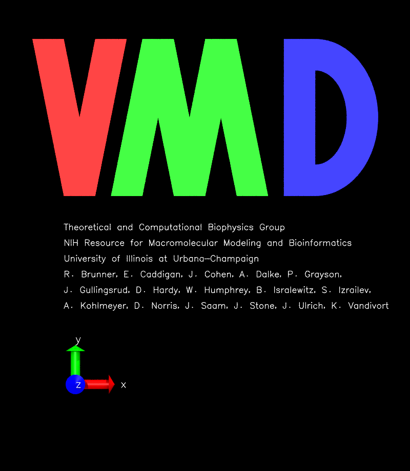

# VMD

VMD(Visual molecular dynamics)は、分子モデリングならびに可視化コンピュータプログラムである。

MDは分子動力学シミュレーションの結果を眺め、解析するためのツールとして主に開発されたが、容積データや配列データ、任意のグラフィックオブジェクトを扱うためのツールも含まれている。

早い話、MD計算のトラジェクトリを可視化できるツールである。


## インストール

[VMD_downloads](https://www.ks.uiuc.edu/Development/Download/download.cgi?UserID=&AccessCode=&ArchiveID=1475)にアクセスし、Namdと同様にアカウント作成、ダウンロードまで進む。

以下`~/App/` にダウンロードしここにインストールする方法。


```shell
# 移動
cd ~/App/

# 展開
tar xvf vmd-1.9.3??????.tar.gz

# 移動
cd vmd-1.9.3/

# (任意)インストールディレクトリの変更をしたい場合は
vi configure

# とし、以下２行を書き換える。
$install_bin_dir="/usr/local/bin";
$install_library_dir="/usr/local/lib/$install_name";

# make 設定
./configure

# 移動
cd src

# インストール
sudo make install
```

一度terminalを閉じて、

```shell
vmd
```

としたときに、



このような画像が出できたらインストール成功である。

(`exit`や左上のFile -> Quit)で閉じることができる。


## 使い方

vmdでトラジェクトリを見るためには、

```shell
vmd <構造ファイル> <トラジェクトリファイル>
```

とする。


### Gromacsの計算結果の場合

```shell
vmd structure.gro trajectory.trr

## ".trr"の他にも、".xtc"でも可
```


### Namdの計算結果の場合

```
vmd structure.psf trajectory.dcd
```


### Lammpsの計算結果の場合

```
vmd structure.psf trajectory.xtc
	or
vmd structure.psf trajectory.dcd
```


## 個人PC(mac)からssh先の`vmd`を起動する場合

mac限定だと思われる

1. `XQuartz`を終了
2. sshしていない(ローカルで)`defaults write org.macosforge.xquartz.X11 enable_iglx -bool true`を実行
3. `ssh`してリモートマシンへ接続
4. vmdが起動するはず。(影の描写には非対応？)

当然だが、ネットの速度に依存してレスポンスが変わるため自宅Wi-Fiではやや反応が悪いか？


## きれいなスナップショットの作り方

### 環境

- VMD for LINUXAMD64, version 1.9.2 (December 29, 2014)
- NVIDIA Corporation GM107GL Quadro K620 (rev a2)


### 想定している系

- 水ー脂質膜のような系
- コレステロール入りの脂質膜
- PEG修飾リン脂質膜など
    - 高分子鎖などはこの方法だと暗くなってしまう可能性あり


### 設定

#### Grafics -->> Colors...


| Categorise |   Names    | Colors  |
| :--------: | :--------: | :-----: |
|  Display   | Background | 8 White |


にして背景を白色にしておく。
上に印刷したりスライドに載せるときは背景を白色にしておくといい。
（ディスプレイ上で見るときは黒が見やすいのだが）

#### Graphics -->> Representations...

##### 分子種ごとに表示を分ける

`Create Rep`を押して分子種の数だけ項目を作り、
`Selected Atoms`で種類の指定をする。
例として

- `resname DMPC`(分子名がDMPCのもの)
- `same residue as resname DMPC and z > 10`(z>10の範囲にあるDMPC分子のみ)
- `water`(水)

といった指定ができるため活用してください。
作った分子種に対して以下の設定（①〜③）をそれぞれ行う。

##### ①色の指定

`Coloring Method`で色の指定ができる。
様々な指定ができるが、`ColorID`を選び右隣のリストから色を直接指定するのが一番きれいになる。
時間がない人は`Name`のままでもいいかな？

##### ②マテリアルの指定

`Material`の欄で描画素材の変更ができる。
個人的には`AOShiny`がおすすめ。明るすぎると思う場合は`Edgy`など選択肢となるか？

##### ③描画タイプの指定

`Drawing Method`で分子のタイプが指定できる。
デフォルトの`Lines`は細すぎるため、`Licorice`がおすすめ。
特に注目したい分子がある場合は`VDW`がいいが、多用し過ぎると見にくくなる。

系に水が含まれる場合は水の設定を以下のようにするといい。

**水の設定**

|       項目       |                設定値                |
| :--------------: | :----------------------------------: |
| Coloring Method  | colorID(10 syanか22 cyan3がおすすめ) |
|  Drawing Method  |              QuickSurf               |
|     Material     |             Transparent              |
|    Resolusion    |                 1.60                 |
|   Radius Scale   |                 1.6                  |
| Density Isovalue |                 3.7                  |
|       Grid       |                 0.8                  |
|     Surface      |                 Max                  |

#### Display

- Perspective -->> Orthographicに変更
- Depth Cueing -->> チェックがついている場合は外す
- Axes -->> Offに（軸が消える）
- Rendermode -->> GLSL
- Display Settings
    - Shadows -->> On
    - Amb. Occl. -->> On
    - AO Ambient -->> 0.90
    - AO Direct -->> 0.60

と設定する。


#### Extensions -->> Tk console

VMD上で使えるコンソールだが、よく使うものとして、

- `pbc box -center origin` (周期境界の箱を表示)
- `color Display Background white` (背景を黒色に)
- `rotate x by 90` (x軸周りに90°回転)

などがある。詳しくは公式サイトを参照

#### File -->> Render
いよいよ画像ファイルとして保存するが、以下のような設定をおすすめする。

|              項目               |            設定値             |
| :-----------------------------: | :---------------------------: |
| Render the current scane using: |  Tachylon or TachylonL-OptiX  |
|            Filename             |         好きなように          |
|         Render Command:         | どこかに`-res 2000`を書き込む |


として`Start Rendering`すれば画像の書き出しが始まる。
生成される画像は`.tga`なので`convert -density 2000 vmd.tga vmd.png`とし
変換するといい。