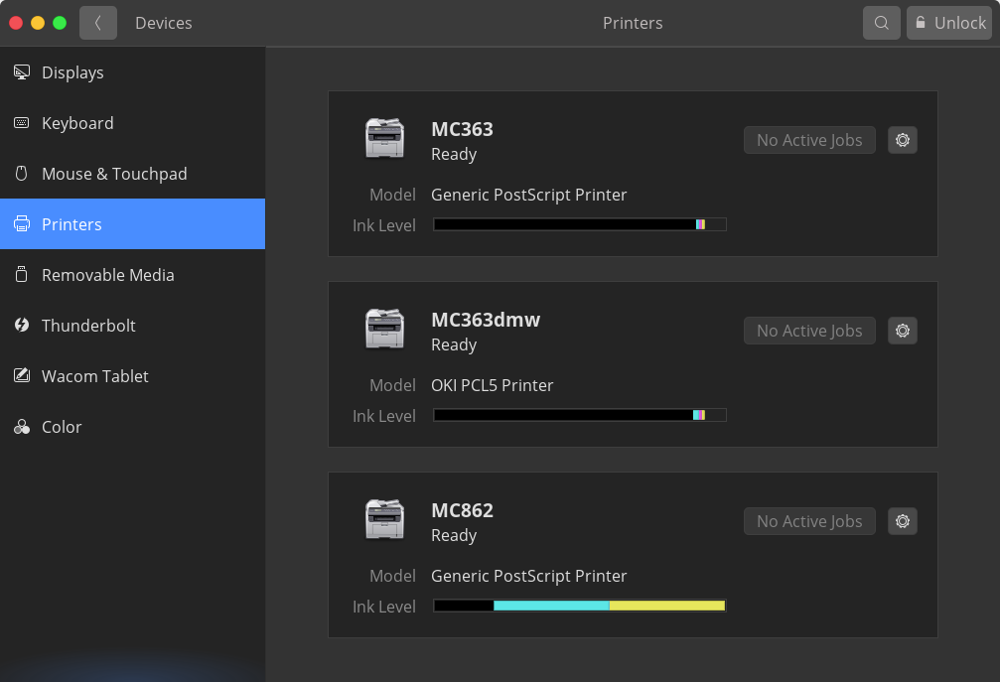
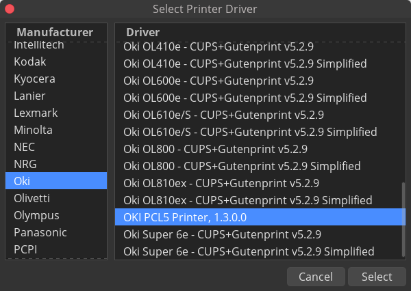
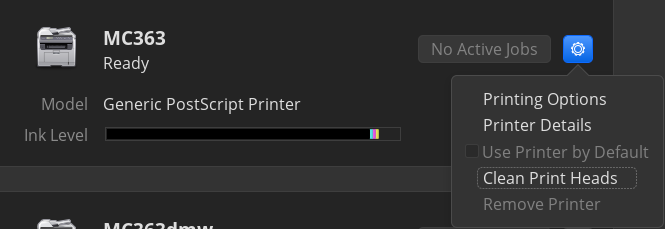

# Device in Lab

## 813号室プリンター

- MC332
- MC363

の2つが稼働している。MC363の方はかなり古く、紙詰まりを起こしやすいのでMC332を推奨する。

### 手順

以下より、対応するプリンターのドライバーをダウンロードしてください。

```eval_rst
:download:`OKI C332 PS.ppd <./OKI C332 PS.ppd>`
```

```eval_rst
:download:`OKI MC363 PS.ppd <./OKI MC363 PS.ppd>`
```

その後、設定→Device→プリンターと進み




右上のUnlockをクリック、パスワードを入力することで新しいプリンターの追加ができるようになる。

下の欄にプリンターのipアドレス(プリンター本体に書いてあることが多い)を入力すると、プリンターの候補が現れるはず。(ipアドレスはなくても追加できる場合がある)


追加したプリンターの歯車アイコン→Printer Detailsと進み

Addressの欄にはプリンターのipアドレスを入力


またSelect from Database...を選び、下の画像のようにOkiのPCL5ドライバーを選択




また歯車アイコン→Printing Optionsと進み



DuplexerはONにしておく。


(正しくドライバーが設定できていれば以下のような表示になるはず、その時はColorをColor Printerにしたり、Duplex UnitもONにしよう）


以上でプリントできるはずだができなかったら田中まで。


816-2(817?)号室プリンター
-----------------------

インストールパッケージは、いろいろ配布されているようだが、簡易インストーラを利用するのが一番いいみたい。

[HL-4570のドライバーサイト](https://support.brother.co.jp/j/b/downloadtop.aspx?c=jp&lang=ja&prod=hl4570cdw)
にアクセス

Linux, **rpm** を選んで、ユーティリティソフトから **Linux簡易インストーラ**を選択し、適当な場所へダウンロードする。

以降は画面の指示に従えばいいが、ここにも書いておく

``` bash
# ダウンロードディレクトリに移動
cd ~/Downloads

# 展開
tar xvf linux-????

# プリンター名(HL-4570)を追加して実行
bash linux-???? HL-4570
```

途中の質問にはすべてyes(y)で答えていけばよく、最後、プリンターと接続するところで、**ipアドレスを指定**を選択し、ipアドレス **192.168.101.101** を入力。

プリンターが追加される。
