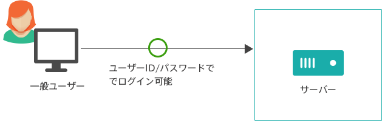

# ssh

MD計算は膨大な時間がかかるため、各地のスパコンを使うことがあるだろう。

スパコンへはssh接続を用いてアクセスするが、これが以外に難しい。

備忘録的にここに使い方をまとめる


## 概要

まずsshとは接続方法の一種である。

またこの認証方式に

- パスワード認証
- 公開鍵認証

が存在するため、ややこしい。

### パスワード認証



このように、ユーザー名とパスワードさえあれば認証ができるシステムである。

### 公開鍵認証


この図の下のように、鍵を所有しかつこの鍵のパスフレーズを知らないと使えない方法である。

イメージとしては、公開鍵は南京錠で秘密鍵は鍵みたいなものである。

実際には、スパコンに公開鍵を設置し、秘密鍵を持って行って照合してもらう感じとなる。


## 使い方

### 鍵の生成

輪講中に鍵を生成していると思うが、新しく鍵を作る場合には、`ssh-keygen -t rsa`コマンドを実行する。

```bash
$ ssh-keygen -t rsa
Enter file in which to save the key (/home/tanaka/.ssh/id_rsa):
# 鍵の保存場所を聞かれる。デフォルトで良ければそのままEnter
Enter passphrase (empty for no passphrase):
# 鍵のパスフレーズを設定する。
# セキュリティの観点から12文字以上の半角英数混合文字を推奨する。
```

これで、`~/.ssh/`の中に

- id_rsa : 秘密鍵
- id_rsa.pub : 公開鍵

が生成される。


### リモートに鍵を配置する

一回目のログインをするためには管理者に鍵をおいてもらうorパスワードを設定する必要がある。

リモートにログインできるようになったら、

- 公開鍵を転送
- `.ssh/`ディレクトリの作成
- 公開鍵登録
- パーミッションの設定

をする。


#### 公開鍵転送

何らかの方法で公開鍵を転送する。ローカル（鍵を作った側）で、

```bash
$ rsync -avuPh ~/.ssh/id_rsa.pub remote_server:~/
```

とし、リモートに公開鍵を転送しておく。


#### `.ssh/`ディレクトリの作成

```bash
$ cd ~
$ mkdir .ssh
```

もちろんすでにある場合はそのままで構わない。


#### 公開鍵を登録

リモートのホームディレクトリに公開鍵(`~/id_rsa`)を転送してあるはずなので、これを登録する。

これは公開鍵を`.ssh/`内で`authorized_keys`という名前で配置する。

```bash
$ cat id_rsa.pub >> ~/.ssh/authorized_keys
```


#### パーミッションの設定

sshで接続できないエラーは大体これをやってないことが原因で起こる。

```bash
$ cd ~
$ chmod 700 ~/.ssh
$ chmod 600 ~/.ssh/authorized_key
```


### ログインしてみる

これで公開鍵認証でログインできるはずである。

ローカルに戻って、

`ssh USERNAME@REMOTE_HOST_NAME`でログインできるはず。(USERNAMEとREMOTE_HOST_NAMEは適宜自分のものに変更してください)

初めて接続する場合は、Fingerprintに関する注意がでるがyesを選択すればいい。

パスフレーズを聞かれ、入力しログインできたら成功である。


### configの設定

毎度アクセスするのに`ssh hogehoge@111.1.1.111`などを入力するのはめんどくさい。

このため、`~/.ssh/config`に設定を記述することで楽に接続できる。

以下サンプル

```
ServerAliveInterval 60

Host	server_1
		Hostname		111.1.1.111
		User 			USERNAME
		IdentitiesOnly	yes
```

- Host
  - 任意の名前
- HostName
  - リモートのホスト名 or IPアドレス
    リモートがLinux の場合`ifconfig`などで確認できる。
- User
  - ログインするユーザーネーム
- IdentitiesOnly
  - yesにしておくといい。


これらを設定することで、`ssh server_1`とするだけでsshログインができるようになる。


### 多段ssh

自分のPC -->> サーバーA -->> スパコンのようにあるサーバーを踏み台にしてスパコンにアクセスすることがあるかもしれない。

その場合も、`~/.ssh/config`を以下のように設定するだけで一発でログインできるようになる。

```
Host	supakon
		Hostname		111.1.1.111
		User 			USERNAME
		ProxyCommand 	ssh USERNAME@server_A nc %h %p 2> /dev/null
		IdentitiesOnly	yes
```

ProxyCommandに、踏み台にするサーバへssh接続するときのコマンドを入力する。

nc %h %p 2> /dev/nullの部分はおまじないと思ってくれていい。（接続終了後の出力を抑制している。）

