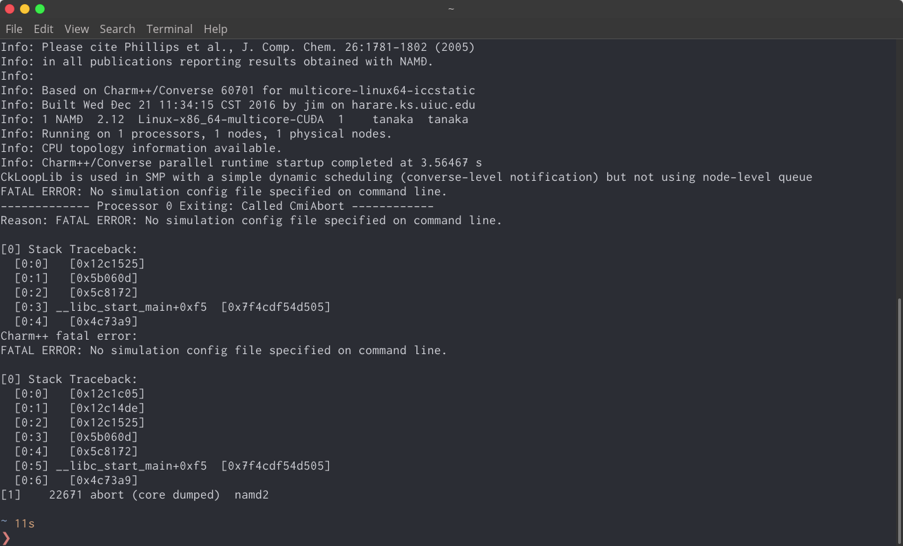

# Namd

## 概要

NAMD (NAnoscale Molecular Dynamics program)は、フリーウェアの分子動力学シミュレーションパッケージの一つである。Charm++並列プログラミングモデルを用いて書かれ、並列効率の高さで知られており、大規模な系（数百万の原子）をシミュレートするためにしばしば使われている。NAMDはイリノイ大学アーバナ・シャンペーン校のTheoretical and Computational Biophysics Group (TCB) とParallel Programming Laboratory (PPL) との共同研究によって開発されている。


## インストール方法(Singlenode版)

手元のPCや、tgpuなど1ノードで計算する場合はこちら

[Download NAMD](https://www.ks.uiuc.edu/Development/Download/download.cgi?PackageName=NAMD)にアクセスし、「[Linux-x86_64-multicore-CUDA](https://www.ks.uiuc.edu/Development/Download/download.cgi?UserID=&AccessCode=&ArchiveID=1566)」とかいてあるものを選択。

（上のリンクはバージョン2.13へのリンクだが、より新しい物がリリースされている場合は新しい物でもいい。）


```eval_rst

.. warning::
    ただし、Namdは **バージョンが異なるソフトで計算された場合、restartファイルの引き継ぎができない** ことがある。

    特にB4の学生は名大CXを使うことが多いが、名大CXにインストールされているNamdのバージョンは2.14bのため、注意が必要。

```

途中アカウントを作成したりするところがあるが、指示に従って進めて行けばいい。

ダウンロードディレクトリを指定するように言われたら、適当なディレクトリでダウンロードする。

(今回は`~/App/`以下にする。)

```shell
cd ~/App/ #ディレクトリ移動
tar xvf NAMD-?????.tar.gz #展開
cd NAMD-????? #Namdのディレクトリに移動
```

Namdはこれでインストールが完成し、起動できるようになっている。

あとはパスを通すだけである。

```shell
vi ~/.bashrc #.bashrcの編集
```

```bash
export PATH=???????　と書いてある行の末尾に
　
:$HOME/App/NAMD-????/

を追加する。
```

確認のため、

```shell
source ~/.bashrc
namd2
```

とやってみる。
```shell
------------- Processor 0 Exiting: Called CmiAbort ------------
Reason: FATAL ERROR: No simulation config file specified on command line.

[0] Stack Traceback:
  [0:0]   [0x12c1525]
  [0:1]   [0x5b060d]
  [0:2]   [0x5c8172]
  [0:3] __libc_start_main+0xf5  [0x7f7cb3da03d5]
  [0:4]   [0x4c73a9]
Charm++ fatal error:
FATAL ERROR: No simulation config file specified on command line.

[0] Stack Traceback:
  [0:0]   [0x12c1c05]
  [0:1]   [0x12c14de]
  [0:2]   [0x12c1525]
  [0:3]   [0x5b060d]
  [0:4]   [0x5c8172]
  [0:5] __libc_start_main+0xf5  [0x7f7cb3da03d5]
  [0:6]   [0x4c73a9]
[1]    18170 abort (core dumped)  namd2

```

このような表示が出れば、インストール及びパスを通すことには成功している。




## インストール方法(Multinode版)

複数ノードでの計算をする場合はこちらを参考にすること。

[Download NAMD](https://www.ks.uiuc.edu/Development/Download/download.cgi?PackageName=NAMD)にアクセスし、「Linux-x86_64-ibverbs-smp-CUDA」とかいてあるものを選択。

```eval_rst
.. warning::
    ただし、Namdは **バージョンが異なるソフトで計算された場合、restartファイルの引き継ぎができない** ことがある。特にB4の学生は名大CXを使うことが多いが、名大CXにインストールされているNamdのバージョンは2.14bのため、注意が必要。
```

途中アカウントを作成したりするところがあるが、指示に従って進めて行けばいい。

ダウンロードディレクトリを指定するように言われたら、適当なディレクトリでダウンロードする。

(今回は~/App/以下にする。)

```shell
cd ~/App/ #ディレクトリ移動
tar xvf NAMD-?????.tar.gz #展開
cd NAMD-????? #Namdのディレクトリに移動
```

あとはパスを通すだけである。


```shell
vi ~/.bashrc #.bashrcの編集
```

```bash
export PATH=???????　と書いてある行の末尾に
　
:$HOME/App/NAMD-????/

を追加する。
```

確認のため、

```shell
source ~/.bashrc
namd2
```

とやってみる。
```shell
------------- Processor 0 Exiting: Called CmiAbort ------------
Reason: FATAL ERROR: No simulation config file specified on command line.

[0] Stack Traceback:
  [0:0]   [0x12c1525]
  [0:1]   [0x5b060d]
  [0:2]   [0x5c8172]
  [0:3] __libc_start_main+0xf5  [0x7f7cb3da03d5]
  [0:4]   [0x4c73a9]
Charm++ fatal error:
FATAL ERROR: No simulation config file specified on command line.

[0] Stack Traceback:
  [0:0]   [0x12c1c05]
  [0:1]   [0x12c14de]
  [0:2]   [0x12c1525]
  [0:3]   [0x5b060d]
  [0:4]   [0x5c8172]
  [0:5] __libc_start_main+0xf5  [0x7f7cb3da03d5]
  [0:6]   [0x4c73a9]
[1]    18170 abort (core dumped)  namd2

```

このような表示が出れば、インストール及びパスは成功している。

### ジョブスクリプトについて

マルチノードで計算を流すためには、`charmrun`というバイナリが必要だったり`nodelist`を指定したりとめんどくさい。

そこで、サンプルジョブスクリプトを作っておいたのでコピペして使ってほしい。

```bash
#!/bin/bash
#QSUB -queue i9acc
#QSUB -node  4
#QSUB -mpi   16
##QSUB -omp   96
#QSUB -place distribute
#QSUB -over false
###PBS -l walltime=01:00:00
#PBS -N NAME
#PBS -j oe
#PBS -o job.out

CONV_RSH=rsh
# cd ${PBS_O_WORKDIR}
. /etc/profile.d/modules.sh

module unload cuda/8.0
module load cuda/6.5
module load intel-mpi/2018.4.274


PATH=/home/HOMENAME/App/NAMD_2.12_Linux-x86_64-ibverbs-smp-CUDA/:$PATH
echo "group main" > list
cat $PBS_NODEFILE | sort -u | sed 's/^/host /g' >> list
echo "exec rsh \$1 \$2 \$3 /bin/bash -f" > myrsh
chmod +x myrsh

charmrun /home/HOMENAME/App/NAMD_2.12_Linux-x86_64-ibverbs-smp-CUDA/namd2 ++ppn 4 ++p 16 ++nodelist list INPUT.conf > INPUT.out

```

重要な部分だけ解説をつける

- `#QSUB -node  4`

  確保するノード数を指定

- `#QSUB -mpi   16`

  確保する総CPU数を指定。東大物性研は1ノード24コアなので最大値は24。

  しかし物性研は1ノードに2枚のグラフィックボードがあるのでおすすめは2*(上で指定した)ノード数がいいだろう。

- `#QSUB -place distribute`

  確保するCPUを書くノードに分散させるオプション。上の例なら{ノード１：４コア}、{ノード２：４コア}…と確保される。ちなみに詰めて確保したい場合は`#QSUB -place pack`とする。

- `module load`系

  Namd2.12は（おそらく）cuda6.5を必要としているため、デフォルトでロードされているcuda8.0をunloadし、cuda6.5をloadしている。デフォルトのバージョンやNamdが必要とするcudaはその時によって変わるので要確認。

- `PATH=/home/HOMENAME/App/NAMD_2.12_Linux-x86_64-ibverbs-smp-CUDA/:$PATH`

  `namd`の実行バイナリがあるディレクトリへのパスを追加する。HOMENAMEの部分を自分のアカウントに合わせてください。

- `echo "group main" > list`、`cat $PBS_NODEFILE | sort -u | sed 's/^/host /g' >> list`

  `list`というファイルに使うノードのリストを格納している。これはこのままで動くはず。

- `echo "exec rsh \$1 \$2 \$3 /bin/bash -f" > myrsh`、`chmod +x myrsh`

  これはいらない気がする。

- `charmrun /home/HOMENAME/App/NAMD_2.12_Linux-x86_64-ibverbs-smp-CUDA/namd2 ++ppn 4 ++p 16 ++nodelist list INPUT.conf > INPUT.out`

  - これが実行コマンドになる。何故か`charmrun`はパスが通っていたが`namd2`はフルパスで指定しないと動かなかった。要検証
  - HOMENAMEの部分を自分のアカウントに合わせてください。
  - INPUTの部分を計算のコンフィグレーションファイル名にしてください。

  - `++ppn`はおそらく(proc per node)。1ノードあたり何個のCPUを利用するかを指定。つまり#QSUB mpi / #QSUB nodeの数になるはず。

  - `++p` は総CPU数。#QSUB nodeと同じ数になるはず。

  - `++nodelist`で先ほど作った`list`ファイルの中身を見ている。

  - `>`標準出力をリダイレクトしている。これがないと動かなかった。


## MD計算:inputfileについて

以下は自分が水ーリボース系での計算をしたときのインプットファイルである。

<details>
  <summary>長いので折りたたんでいます（クリックで展開）</summary>
  <div>


```
#############################################################
## JOB DESCRIPTION                                         ##
#############################################################

structure           ./step2_autopsf.psf
coordinates         ./step2_autopsf.pdb
set outputname      p3_npt

#NOTE:WHEN CONTINUING A SIMULATION USE RESTART FILES AND COMMENT OUT SET TEMP.#
# set inputname       p2_nvt
# bincoordinates      $inputname.coor
# binvelocities       $inputname.vel
# extendedSystem      $inputname.xsc
extendedSystem      initial.xsc
set temperature     310.
temperature	    $temperature
#NOTE:WHEN CONT. A SIM. MAKE FIRST TIMESTEP THE LAST TIMESTEP OF THE LAST DCD FILE#
firsttimestep      0


#############################################################
## SIMULATION PARAMETERS                                   ##
#############################################################
#Remove input temp when continuing
# Input
paraTypeCharmm       on
parameters          /home/tanaka/toppar_all36/par_all36_lip_peg_new.prm
parameters          /home/tanaka/toppar_all36/par_c36_sm_chol.prm
#parameters          ../../toppar_all36/par_all35_ethers.prm

# Force-Field Parameters
exclude             scaled1-4
1-4scaling          1.0
cutoff              12.
switching           on
switchdist         10.0
pairlistdist       14.0
margin              5.0
vdwForceSwitching   on

# Integrator Parameters
timestep            2.0  ;# 2fs/step
#timestep            1.0  ;# 2fs/step
rigidBonds          all  ;# Needed for 2fs steps
nonbondedFreq       1
fullElectFrequency  2
stepspercycle       20

# Constant Temperature Control
langevin            on    ;# do langevin dynamics
langevinDamping     5     ;# damping coefficient (gamma) of 5/ps
langevinTemp        310.
langevinHydrogen    off    ;# don't couple langevin bath to hydrogens

#NOTE:WHEN CONT A SIM TURN THESE OFF AS THEY WILL BE READ FROM RESTART XSC FILE#
# Periodic Boundary Conditions
cellOrigin           0.          0.0             0.0
wrapWater           on

# PME (for full-system periodic electrostatics)
PME                  yes
PMEGridSizeX       64
PMEGridSizeY       64
PMEGridSizeZ       84

# Constant Pressure Control (variable volume)
useGroupPressure      yes ;# needed for rigidBonds
useFlexibleCell       no
# useFlexibleCell       yes
useConstantRatio      no
# useConstantRatio      yes :# default is xy couple

langevinPiston        on
langevinPistonTarget  1.01325 ;#  in bar -> 1 atm
langevinPistonPeriod  200.
langevinPistonDecay   100.
langevinPistonTemp    310.

# Output
outputName          $outputname

restartfreq          5000    ;# 500steps = every 1 ps
dcdfreq              1000
#dcdUnitcell         yes
xstFreq             500
outputEnergies      500
outputPressure      500


#############################################################
## EXECUTION SCRIPT                                        ##
#############################################################
#NOTE:WHEN CONT A SIM DO NOT MINIMIZE#
# Minimization
minimize           10000
#reinitvels          300
run   5000000 ;# 10 ns
```
順に解説していく


  </div>
</details>


```
# 結合や質量ファイル(.psf)の指定
structure           ./step2_autopsf.psf

#初期配置の指定
coordinates         ./step2_autopsf.pdb

#outputファイル名の指定
#aaa という名前にするとaaa.dcdやaaa.velなどのファイルが出力される。
```

```
# もし前の計算を引き継ぎたいときは、以下４行のコメントアウト（#）を外す。

# 引き継ぐファイルのファイル名（拡張子は不要）
# set inputname       p2_nvt

# 以下３行はそのまま。
# bincoordinates      $inputname.coor
# binvelocities       $inputname.vel
# extendedSystem      $inputname.xsc
```

```
# 系のサイズ情報が入ったデータの指定（フォーマットがあるので他のものからコピペ安定）
extendedSystem      initial.xsc

# 温度の指定。２行必要
set temperature     310.
temperature	    $temperature
```

```
# 何タイムステップ目から計算を始めるか。
# 通常は0だが、計算の引き継ぎをしている場合は50000000とかになる点に注意

firsttimestep      0
```

```
# charmm形式のパラメーターを使う場合、そのパスを指定する。
# 基本的にはcharmm-guiでダウンロードされるものを指定すればいい。

paraTypeCharmm       on
parameters          /home/tanaka/toppar_all36/par_all36_lip_peg_new.prm
parameters          /home/tanaka/toppar_all36/par_c36_sm_chol.prm
```

```
# 1-4相互作用の除外やカットオフ数値の指定
# 基本的にはこのままでいい。

exclude             scaled1-4
1-4scaling          1.0
cutoff              12.
switching           on
switchdist         10.0
pairlistdist       14.0
margin              5.0
vdwForceSwitching   on
```

```
# 2fs / 1 timestepという刻み幅の指定
# それ以外はそのまま。

timestep            2.0  ;# 2fs/step
rigidBonds          all  ;# Needed for 2fs steps
nonbondedFreq       1
fullElectFrequency  2
stepspercycle       20
```

```
# 温度をlangevin熱浴で制御するコマンド。
# はじめに指定した温度とあわせる。
# シミュレーションの世界では能勢-Hoovar熱浴を使うべきらしいがNamdは非対応。

langevin            on    ;# do langevin dynamics
langevinDamping     5     ;# damping coefficient (gamma) of 5/ps
langevinTemp        310.
langevinHydrogen    off    ;# don't couple langevin bath to hydrogens
```

```
# なんであるのかわからなかったけど多分必要

cellOrigin           0.          0.0             0.0
wrapWater           on
```

```
# Particle mesh ewald法を使うかとそのグリッドサイズの指定。
グリッドサイズはそれぞれシステムサイズ（Å）を5で割ったくらいの値にするといいらしい。

PME                  yes
PMEGridSizeX       64
PMEGridSizeY       64
PMEGridSizeZ       84
```

```
# なんであるのかわからなかったけど多分必要

useGroupPressure      yes ;# needed for rigidBonds
useFlexibleCell       no
useConstantRatio      no
```

```
# 圧力制御にlangevin Pistonを使うかとその値。
# 圧力は通常1atmなので温度だけはじめの値と合わせる。

langevinPiston        on
langevinPistonTarget  1.01325 ;#  in bar -> 1 atm
langevinPistonPeriod  200.
langevinPistonDecay   100.
langevinPistonTemp    310.
```

```
# restartファイルやトラジェクトリファイルを何ステップごとに出力するかといった値。
# 理由がなければ以下の値を使えばいい。

restartfreq          5000    ;# 500steps = every 1 ps
dcdfreq              1000
#dcdUnitcell         yes
xstFreq             500
outputEnergies      500
outputPressure      500
```

```
# はじめの10000ステップはminimize（構造最適化）
# その後シミュレーションを5000000ステップ行う。

minimize           10000
run   5000000 ;# 10 ns
```

