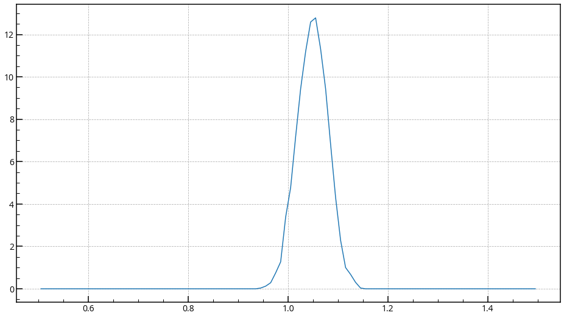

# MDAnalysis

pythonでMDのトラジェクトリ解析ができるとても便利なライブラリ。筆者が使っている粗視化も解析可能。

岡崎研究室の標準装備にしてほしいぐらい。

日本語のチュートリアルも用意したので、ここでは便利な使い方を述べようと思う。


### 注意

以下特に記載しない限り、`MDAnalysis.tests.datafiles`を解析することとする。

つまり、以下のように読み込みを行った。各自自分のトラジェクトリに書き換えてほしい。

```python
import MDAnalysis as mda
from MDAnalysis.tests.datafiles import PSF, DCD

u = mda.Universe(PSF, DCD)
```


## 結合距離や結合角度の分布

- Bond
- Angle
- Dihedral
- Improper

のようなものの分布を取りたいことがよくある。

以前までは原子の座標を元に計算していたが、便利な方法があった。

この方法は、結合の情報があるファイル(`.psf, .top`)のようなファイルを読み込んでいる必要がある。

（全原子の人は大丈夫だが、粗視化の方は`psf`ファイルがないことがあるので注意。）


### How to do

bondの情報は、`u.bonds`にあるため、

```python
u.bonds.values()

Out[9]:
array([0.9920841 , 1.04387783, 1.05986122, ..., 1.48551149, 1.23613035, 1.27404232])
```

とするだけですべての値が帰ってくる。

`u.bonds.types()`

```python
u.bonds.types()

Out[11]:
[('56', '2'),
 ('56', '22'),
 ('22', '6'),
 ('22', '23'),
 ('22', '20'),
 ('23', '3'),
 ('23', '23'),
 ('23', '81'),
	...
```

とすると、このような('56', '2')間に結合がある、('56', '22'))間に結合がある、、、ということがわかる。

（ここはトポロジーファイルによるが、筆者の環境では('BPY1', 'BPY2')のように原子名で帰ってきた。）


このままでは系のすべての原子の結合距離が帰ってきているだけなので、扱いにくいが**特定の結合のみを選択できる**方法がある。

それが`u.bonds.select_bonds()`であり、以下のようにすると系内の('56', '2')の結合がリストアップされる

```python
u.bonds.select_bonds(("56", "2"))

Out[14]:
<TopologyGroup containing 57 bonds>
```

これで内の('56', '2')の結合は全部で57個あることがわかる。

これらをある変数に入れれば、

```python
bond_56_2 = u.bonds.select_bonds(("56", "2"))
bond_56_2.value()

Out[15]:
array([0.9920841 , 1.04387783, 1.05986122, 1.02430087, 1.00244858,
       1.08620145, 1.12806992, 1.07843619, 1.08142101, 1.01416071,
       1.05287512, 1.04886808, 0.99766399, 1.00003621, 1.02626758,
       1.07063078, 1.0252231 , 1.04982561, 1.02731704, 1.04538002,
       0.97738312, 1.04356518, 1.03284141, 1.02616466, 1.00372859,
       1.04293945, 1.07048629, 1.06736889, 0.98279084, 1.03083272,
       1.00475292, 1.0364446 , 1.05372188, 1.0539615 , 1.07159869,
       0.99642071, 1.01829042, 1.02883738, 1.08943846, 1.06097044,
       1.05503523, 1.0580378 , 1.05361057, 1.09457956, 1.01966215,
       1.01909983, 1.05836955, 1.03081077, 1.01146875, 1.06153019,
       1.04555022, 1.10118977, 1.01986004, 1.00225317, 1.05128511,
       1.06324096, 1.07451991])
```

と57個の値がわかる。

平均値は`np.mean`関数、分散には`np.var`関数を使えばいいので、

```python
print (f"ave = {np.mean(bond_56_2.value())}")
print (f"var =  {np.var(bond_56_2.value())}")

Out[21]:
ave = 1.0415366866943487
var =  0.0009741406409815192
```

と出力できる。

これは0フレーム目の値であるため、実際はトラジェクトリ全体の値を取ることが多い。

```python
bond_56_2 = u.bonds.select_bonds(("56", "2")) # 56_2結合を変数bond_56_2へ
bond_56_2_values = [bond_56_2.values() for ts in u.trajectory]
# bond_56_2_valuesリストに値だけを取り出して全フレーム入れている。

bond_56_2_values

Out[25]:
[array([0.9920841 , 1.04387783, 1.05986122, 1.02430087, 1.00244858,
        1.08620145, 1.12806992, 1.07843619, 1.08142101, 1.01416071,
        1.05287512, 1.04886808, 0.99766399, 1.00003621, 1.02626758,
        1.07063078, 1.0252231 , 1.04982561, 1.02731704, 1.04538002,
        0.97738312, 1.04356518, 1.03284141, 1.02616466, 1.00372859,
        1.04293945, 1.07048629, 1.06736889, 0.98279084, 1.03083272,
        1.00475292, 1.0364446 , 1.05372188, 1.0539615 , 1.07159869,
        0.99642071, 1.01829042, 1.02883738, 1.08943846, 1.06097044,
        1.05503523, 1.0580378 , 1.05361057, 1.09457956, 1.01966215,
        1.01909983, 1.05836955, 1.03081077, 1.01146875, 1.06153019,
        1.04555022, 1.10118977, 1.01986004, 1.00225317, 1.05128511,
        1.06324096, 1.07451991]),
 array([1.08883816, 1.04437935, 1.06883167, 1.01673048, 1.08687382,
        1.01842423, 1.13626199, 1.04560706, 1.04277412, 1.00181378,
        1.04469295, 1.0692042 , 1.00445204, 0.99508404, 1.01103037,
        1.10395406, 1.04308044, 1.08105294, 1.07861188, 1.07887897,
        1.03391751, 0.96557905, 1.06104523, 1.07031299, 1.02165913,
        1.03979031, 1.0329544 , 1.02129176, 1.03410283, 1.02463884,
        1.0498579 , 1.02403606, 1.05884195, 1.05968398, 1.05825425,
```

`bond_56_2_values`リストにフレームごとの結合距離が入っているのがわかる。

平均や分散の`np.mean`関数、`np.var`関数は入れ子になったリストでも計算できるので、

```python
print (f"ave = {np.mean(bond_56_2.values())}")
print (f"var =  {np.var(bond_56_2.values())}")

Out[30]:
ave = 1.0415366866943487
var = 0.0009741406409815192
```

とできる。

あとはヒストグラムを作り、グラフのプロットができればいい。

```python
# ヒストグラム作成
hist_vals, hist_bins = np.histogram(bond_56_2_values, range=(0.5, 1.5), bins=100, density=True)
hist_bins = [(hist_bins[i] + hist_bins[i+1] ) / 2. for i in range(0, len(hist_bins)-1)]

# プロット
fig = plt.figure(figsize=(16,9))
ax = fig.add_subplot(111)
ax.plot(hist_bins, hist_vals)
plt.show()
```



